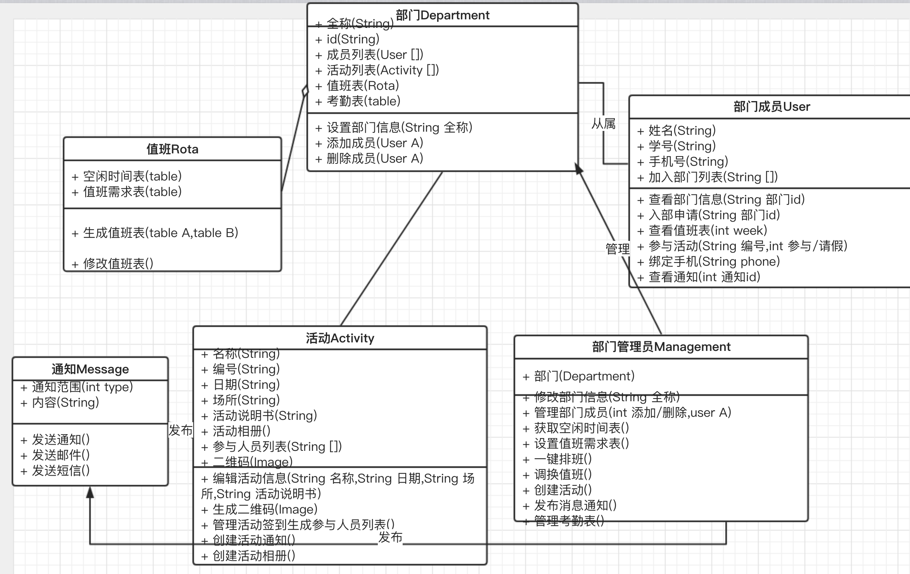
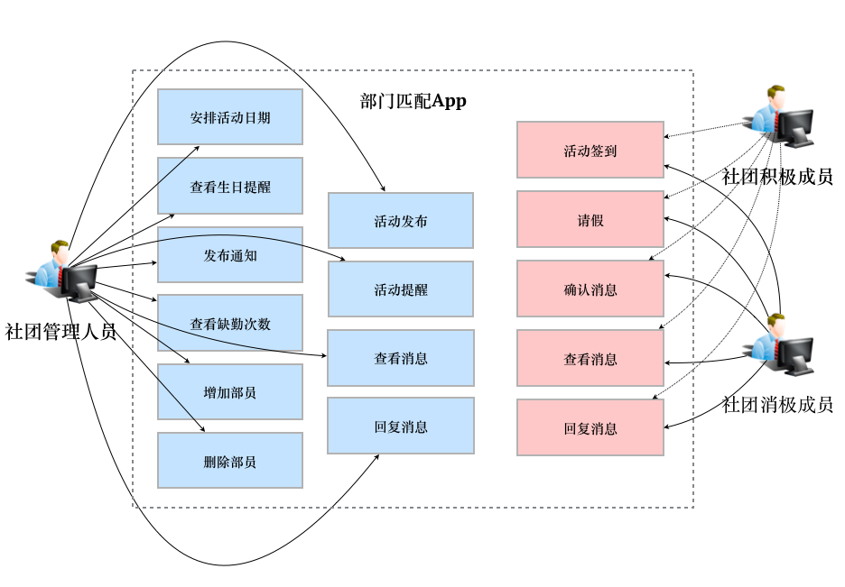

# 需求规格说明书：2017秋季 软件工程 团队作业 需求规格说明书

# 1.引言

## 1.1.编写目的

此部门管理系统是专门对大学中的部门和社团所设计的，用于通过自动排班，群发公告，现场签到等功能来完成对部门方便的系统化管理。为了能够更好地获取用户需求，我们小组基于部门活动情况进行了全面深入探讨，采访以及分析，得出了此份使得系统开发者清楚了解用户需求的软件需求规格说明书。

本书预期读者为用户，业务或需求分析人员，测试人员，用户文档编写者，项目管理人员。

## 1.2.项目背景

* 软件名称：部门管理系统
* 任务提出者：福州大学软工实践“我说嘻(xì)哈(hà)你说侠”小组
* 项目开发者：福州大学软工实践“我说嘻(xì)哈(hà)你说侠”小组

## 1.3.预期的读者和阅读建议

此需求规格说明针对项目经理，设计人员，开发人员，用户以及测试人员，本文分别介绍了产品开发意图，未来前景，用户功能与场景，以及运行环境的具体描述。

## 1.4.项目范围

学校中各个部门以及社团在开学初的排班以及活动通知和现场签到中通常都是手动操作的，耗费人力与时间，大大降低了效率，急需一套实用的部门管理系统，自动化地排班发布公告等，来方便管理者和部门的运转。此部门管理系统的潜在对象为大学中的各大部门与社团。

## 1.5.参考资料

- 1.《GB8567-88 计算机软件需求说明编制指南》
- 2.《GB8567-88 计算机软件产品开发文件编制指南》

# 2.总体描述

## 2.1.目标

### 2.1.1.开发背景

当前社团的各方面管理工作主要都由手工完成，对社团管理人员而言，工作量庞大，机械重复性强，冗余而繁琐。同时，大量重复工作也容易出现纰漏，可能造成资源的浪费，耗时耗力却可能达不到好的效果。对社团成员而言，信息碎片化缺少管理，可能导致信息的延迟、遗漏。

一个合理有效的社团管理系统能够从一定程度上简化当前重复性的工作方式，减轻管理人员的工作量，并提高效率，减少纰漏，帮助管理人员更好更快地管理社团。同时，社团系统的综合使得信息更为集中化，能为社团成员提供方便快捷的途径参与社团活动。因此，社团系统的开发与维护成为需求的一部分。

### 2.1.2.开发意图

- 1.减轻社团管理人员的工作量，为他们提供更高效的管理方式；
- 2.整合集结社团相关信息，让社团成员更方便地参与社团活动；
- 3.通过团队合作，学习与他人沟通、磨合的方式，培养团队意识；
- 4.在实践中"做中学"，提高姿势水平。

### 2.1.3.应用目标和作用范围

该系统面向高校社团的高层管理人员以及全体部员，当前阶段主要是面向福州大学内的社团。该系统为独立的系统，用于社团管理，与其他系统没有关联。

### 2.1.4.产品前景

经过调研，市场上针对高校社团管理的app虽有数十款，但许多产品具有无法注册无法登录等严重错误，广泛应用、解决痛点的app还未可见。同时，我们的产品现阶段主要瞄准福大学子为用户群体，团队容易针对本校实际情况进行改进与更新，因此我们的产品具有很大竞争力。
产品开发后将与校内部门进行合作，让部门成员使用我们的产品。产品在本校进行内测与完善，届时若效果良好可以将产品在高校间推广。

## 2.2.用户特点

### 2.2.1.最终用户及特点

本项目用户主要有以下三类：社团管理人员、社团积极成员、社团消极成员。这三种成员分别具有如下特点：

(1)社团管理人员使用本项目的主要目的在于：
- 根据部员的空闲时间信息，得到潜在可行的活动安排日期；
- 得到部员生日信息，辅助活动日程安排；
- 日常通知部员部门内部活动信息；
- 对本部门进行人员管理；
- 进行活动签到；
- 对本部门进行人员出勤管理。

(2)社团积极成员使用本项目的主要目的在于：
- 查看部门活动通知；
- 回复部门活动通知。

(3)社团消极成员使用本项目的主要目的在于：
- 查看部门活动通知；
- 请假。

### 2.2.2.软件使用频率

对于部门管理人员，需要一天多次访问APP，以进行部门日常活动管理；
对于部员，一天内同样也需要多次访问APP，以查看部门所推送的消息，举行活动时进行活动签到。

### 2.2.3.用户场景

**一、背景：**

**1) 典型用户**

(1)社团管理者小鹿：

| 姓名           | 鹿含                                       |
| ------------ | ---------------------------------------- |
| 年龄           | 21岁                                      |
| 代表的用户在市场上的比例 | ~30%                                     |
| 重要性          | 很重要，对于是否使用APP进行社团管理有决定权                  |
| 生活/工作情况      | 在校学生，目前是某大型社团领导人                         |
| 知识层次和能力      | 本科生，离不开手机，日常频繁通过手机与他人进行通信；平时还需要通过PC端Excel做表格 |
| 用户偏好         | 社交管理                                     |
| 典型场景         | 通过手机群发部门活动短信，组织部门活动，确认大家都收到信息了           |
| 典型描述         | 部门存我存，部门亡我亡                              |

(2)社团积极成员晓彤：

| 姓名           | 管晓彤                            |
| ------------ | ------------------------------ |
| 年龄           | 18岁                            |
| 代表的用户在市场上的比例 | ~60%                           |
| 重要性          | 社团管理APP的主要用户                   |
| 生活/工作情况      | 在校学生，国民闺女                      |
| 知识层次和能力      | 本科生，平时通过手机上网，QQ、微信聊天，还喜欢刷刷微博热门 |
| 用户偏好         | 跳舞，聊天                          |
| 典型场景         | 听从小鹿学长指挥，积极参与社团活动              |
| 典型描述         | 听帅气部长的话                        |

(3)社团消极成员程祥：

| 姓名           | 程祥                          |
| ------------ | --------------------------- |
| 年龄           | 20岁                         |
| 代表的用户在市场上的比例 | ~10%                        |
| 重要性          | 社团管理APP的主要用户                |
| 生活/工作情况      | 在校学生                        |
| 知识层次和能力      | 计算机专业学生，使用电脑的频率高于使用手机的频率    |
| 用户偏好         | 平时热爱运动，喜欢踢足球，喜欢各个方面都插足      |
| 典型场景         | 消息很晚才回，经常请假                 |
| 典型描述         | 我的时间非常宝贵，那这次部门活动/今天的课还是不去了吧 |

**2) 用户的需求 / 迫切需要解决的问题**

社团管理者小鹿：
- 每次组织活动都需要收集每个部员的空闲时间，从而再推导得到活动的具体时间和安排；
- 活动开始前，要通过群发短信逐个部员通知，并确认谁到场谁缺席；评选部门之星时需要根据部员出勤率找出优秀部员，因此需要在PC端记录出勤信息，非常麻烦；
- 需要记录部员的请假信息，有时候是QQ的信息，有时候是微信的信息，忙着忙着就忘记了谁请假，询问时才回想起来；
- 在考虑活动的时候，需要根据部员的一些信息来进行组织，比如当月有好多个同学过生日，就可以组织一个大趴体来庆祝一下，但是这些信息一条条记录到excel里面要花费不少的精力和时间；
- 举办活动当天有时候还需要签到，来确定奖品、综测发放的名额。

社团积极成员晓彤：
- 每周都要把自己当周的课表、空闲时间发给小鹿学长，好烦。

社团消极成员程祥：
- 有的时候会忘记回复小鹿学长发过来的信息，他打电话过来确认的时候再请假好不好意思啊。

**3) 假设**

APP的基本功能均已实现。基本功能包括：
- 活动安排；
- 生日提醒；
- 活动发布；
- 考勤审核；
- 部员管理；
- 消息；
- 请假；
- 活动签到。

**二、场景：**

小鹿发现最近成员们的参与社团热情度有所减弱，决定组织一波吃喝玩乐的活动来收拢人心。说干就干，他打开了部门管理APP，输入了他的账号及密码，一旦他的账号密码输入错误，会被错误提醒。接着，小鹿选择进入他管理的A部门，在生日提醒模块逐月查看了大伙的生日，发现十一月份过生日的人有点多，于是决定挑选十一月份的某一天来举行大趴体。

他进入到活动安排模块，选择十一月，该模块便根据十一月份每个部门成员的课表，生成并列举了一些可行的活动日期。在和部门的其他核心骨干商量之后，决定在11.23号这天来举办大趴体。于是乎，他来到了活动发布模块，为了给过生日的同学一个惊喜，小鹿选择只告诉他们是举办一次部门例会，于是编辑了两种不同的信息安排。在依次输入活动安排时间、地点、描述以及选择发送对象之后，他可以选择退出编辑、保存不发送以及保存并发布。小鹿选择了发布活动信息，APP会判断通知的完整性，必要时进行提示。

管晓彤同学在上课时收到了部门APP的推送，兴致勃勃的她进入A部门，打开消息模块点开小鹿的消息，发现马上有一次关于吃吃吃的活动要举办了，而且举办的时间没有冲突，有两个按钮供晓彤选择，确认回复和请假，她点击确认回复按钮表示自己收到了这条信息。管晓彤确认之后，小鹿在消息模块中立即收到了来自她的确认。在所有人确认回复之后，小鹿能够在活动安排模块查看到这次活动的详细信息，如确认到场人数、缺勤人数，以及活动地点和时间。

活动前夕，小鹿根据人数定制了一个大蛋糕，并进入消息模块，查看本次活动并点击再次提醒按钮，编辑信息并确认发送，以提醒部员们。晓彤收到信息推送之后，进入活动提醒模块设置了这次活动的闹钟，并带着满满的期待点击了确认。而A部门的另一个成员程祥觉得那天自己没有时间，又不知道是给自己举办的趴体(推送通知说是"一次组会")，于是乎在请假模块选择了该活动，随便填写了信息点击申请。小鹿在消息模块看到程祥的申请提醒之后，叹了口气，来到考勤审核模块确认并批准了他的事情，系统提醒程祥的缺勤次数以及超过上限，小鹿发现程祥的缺勤次数早已超过了6次，于是下定决心，点击了旁边的移除该部员按钮，系统显示"程祥同学已被列入潜在移除名单，详细操作请进入部员管理模块"字样，并提供了"确认"、"取消"按钮，小鹿选择了确认，并进入部员管理模块，点击进入潜在移除名单，找到程祥同学的信息，点击红色的移除该部员按钮，并编辑移除信息，点击确认，系统提示"本次操作将从您的部门中移除程祥同学，操作后不可恢复，请问确认要执行该操作吗？"，小鹿点击确认。

活动时间当天，小鹿早早的来到了会场，精心布置了一番，并进入A部门的活动签到模块，开启本次活动的签到模式。晓彤来到会场之后，打开APP的活动签到模块，并点击签到。活动快开始了，小鹿进入活动签到模块，发现还有两三个人还没有签到，于是点击提醒按钮，编辑信息并发送对还没有到场的同学进行了催促。

趴体举办地很成功，小鹿进入部门A的活动安排模块，选择该活动点击结束，系统弹出本次到场总人数、缺勤总人数，并列举了缺勤的同学信息，提供"确认到场"按钮以防止同学忘记签到的情况，对于缺勤的同学，系统在考勤审核模块记录了本次缺勤的情况。

### 2.2.4.用例图

## 2.3.假定与约束

### 2.3.1.假定

- 1.可操作性：假定使用本系统的用户在经过一段时间熟悉之后，可以灵活地操作本系统。
- 2.用户支持：假定在本系统开发的各个环节中得到用户的有效支持和配合。
- 3.技术支持：假定开发初期，小组成员充分认识本系统的需求，认真学好相关知识。开发过程中遇到技术问题，可以及时得到老师的指导与帮助。
- 4.人员配合：假定小组成员不会出现突发性的变动，而导致项目无法正常继续。
- 5.时间限定：假定项目的截止时间不会提前。
- 6.需求限定：假定项目需求基本基本确定之后，不会有太大改变。

### 2.3.2.约束

**1.人员约束：**
- 团队成员均为大三学生，共 8 人。

**2.管理约束：**
- (1)本次开发，实行以一人担任小组组长，分工合作的模式进行。力求每个人的分工涉及开发过程中的所有流程，并按照进度表进行，开发过程中遇到的问题通过小组会议得到一致的解决。
- (2)小组成员首次合作，需要一个磨合过程，需要明确自身责任，分清各自的任务，互相配合，遇到问题小组组长必须能够有效进行协调，才能快速、有效地完成开发过程。

**3.技术约束：**
- 小组成员在相关技术水平方面存在一定欠缺，缺乏相关项目经验，在文档编制能力方面也有待提升。

**4.时间约束：**
- (1)本系统开发周期较短，时间相对紧张。
- (2)开发软件投入使用的最迟时间为2017年12月17日。

**5.其他约束：**
- 由于在开发期间，小组成员还有其他科目的学习任务和外出比赛，将对项目进度造成一定的影响。

## 2.4.运行环境

安卓手机客户端。

# 3.界面原型

# 4.系统功能描述及验收验证标准

## 4.1.对功能的约定

### 4.1.1.用户登录

| 测试功能 | 测试项       | 输入/操作        | 检验点                                      | 预期结果           |
| ---- | --------- | ------------ | ---------------------------------------- | -------------- |
| 用户登录 | flash启动界面 |         | 能够显示不同的logo页面(考虑添加广告)                    | 动态显示不同图片       |
| 用户登录 | 登录动作      |     点击登录     | 报错提示 | 无法登录; 界面弹出报错信息 |
| 用户登录 | 登录动作      |     点击登录     | 学号或密码格式不正确，报错提示 | 无法登录; 界面弹出报错信息 |
| 用户登录 | 登录动作      |     点击登录     | 学号或密码校验不通过，报错提示 | 无法登录; 界面弹出报错信息 |
| 用户登录 | 登录动作      | 输入学号和密码，点击登录 | 学号或密码格式不正确，报错提示                          | 无法登录; 界面弹出报错信息 |
| 用户登录 | 登录动作      | 输入学号和密码，点击登录 | 学号或密码校验不通过，报错提示                          | 无法登录; 界面弹出报错信息 |
| 用户登录 | 登录动作      | 输入学号和密码，点击登录 | 学号和密码验证通过，成功跳转                           | 登录成功; 进入相关界面   |
| 用户登录 | 忘记密码      | 点击进入手机验证     | 成功跳转手机短信验证界面                             | 正常跳转           |
| 用户登录 | 忘记密码      | 点击进入手机验证     | 验证                                       | 验证成功进行修改密码     |

### 4.1.2.部门管理人员主页

| 测试功能     | 测试项    | 输入/操作      | 检验点              | 预期结果         |
| -------- | ------ | ---------- | ---------------- | ------------ |
| 部门管理人员主页 | 主界面    |         | 主界面为部门管理功能列表     | 管理功能界面齐全     |
| 部门管理人员主页 | 主界面    |    点击登录   | 底部由导航栏组成，中间为添加按钮 | 分类符合用户使用逻辑   |
| 部门管理人员主页 | 部门信息管理 | 点击新建部门     | 页面跳转             | 跳转至新建部门信息页面  |
| 部门管理人员主页 | 部门信息管理 | 点击修改部门信息   | 页面跳转             | 跳转至修改部门信息页面  |
| 部门管理人员主页 | 部门信息管理 | 删除，解散部门    | 页面跳转             | 跳转至删除/解散部门页面 |
| 部门管理人员主页 | 部门信息管理 | 绑定部门管理者手机号 | 弹窗输入手机号获取短信验证码绑定 | 绑定成功         |

### 4.1.3.部门基础信息模块

| 测试功能     | 测试项     | 输入/操作    | 检验点                | 预期结果                   |
| -------- | ------- | -------- | ------------------ | ---------------------- |
| 部门基础信息模块 | 新建部门    | 输入部门基本信息 | 部门名称冲突，报错提示        | 提示部门全称已存在              |
| 部门基础信息模块 | 新建部门    | 输入部门基本信息 | 信息填写不完整，报错提示       | 提示信息填写不完整              |
| 部门基础信息模块 | 新建部门    | 输入部门基本信息 | 信息填写齐全，添加按钮变为可点击状态 | 按钮从灰色变为彩色              |
| 部门基础信息模块 | 新建部门    | 点击确认添加   | 成功添加部门提示           | 数据库新增部门，添加成功提示，并跳转     |
| 部门基础信息模块 | 修改部门信息  | 修改部门原信息  | 显示原信息，并可修改         | 信息显示正确，修改并同步数据库记录      |
| 部门基础信息模块 | 修改部门信息  | 点击确认修改   | 修改成功并显示最新信息        | 信息显示正确                 |
| 部门基础信息模块 | 解散/删除部门 | 检验手机验证码  | 检验错误，错误提示          | 错误提示                   |
| 部门基础信息模块 | 解散/删除部门 | 检验手机验证码  | 检验正确，页面跳转          | 弹出是否确认删除提示框            |
| 部门基础信息模块 | 解散/删除部门 | 点击确认删除   | 成功提示，并发送解散通知       | 部员收到部门解散app内通知，数据库数据删除 |

### 4.1.4.消息通知管理(管理员)

| 测试功能        | 测试项    | 输入/操作   | 检验点               | 预期结果                  |
| ----------- | ------ | ------- | ----------------- | --------------------- |
| 消息通知管理(管理员) | 初始界面   |         | 顶部tab可切换部门和全校通知   | tab点击切换正常             |
| 消息通知管理(管理员) | 初始界面   |         | 主页面为通知列表          | 数据显示正确                |
| 消息通知管理(管理员) | 初始界面   |         | 页面右下角有个"+"号，并可点击  | "+"号点击后出现西发布部门/全校通知选项 |
| 消息通知管理(管理员) | 通知信息查看 | 点击通知    | 查看通知详情            | 通知显示正常                |
| 消息通知管理(管理员) | 通知信息查看 | 删除、忽略通知 | 通知长按，单个/批量删除通知    | 删除后移除列表，其余正常显示        |
| 消息通知管理(管理员) | 发布校内通知 | 填写消息内容  | 内容不完整，错误提示，发布按钮失效 | 提示信息不完整的位置            |
| 消息通知管理(管理员) | 发布校内通知 | 填写消息内容  | 内容完整，发布按钮生效       | 按钮可以正常点击              |
| 消息通知管理(管理员) | 发布校内通知 | 点击发布    | 发布成功              | 所有app使用者可以查看该条通知      |
| 消息通知管理(管理员) | 发布校内通知 | 防垃圾通知   | 一个部门一天内最多发布5条通知   | 发布5条以上通知报错            |

| 测试功能        | 测试项     | 输入/操作     | 检验点               | 预期结果                  |
| ----------- | ------- | --------- | ----------------- | --------------------- |
| 消息通知管理(管理员) | 发布部门内通知 | 填写消息内容    | 内容不完整，错误提示，发布按钮失效 | 提示信息不完整的位置            |
| 消息通知管理(管理员) | 发布部门内通知 | 填写消息内容    | 内容完整，发布按钮生效       | 按钮可以正常点击              |
| 消息通知管理(管理员) | 发布部门内通知 | 选择需要通知的部员 | 批量选择通知人员          | 多选框显示正常               |
| 消息通知管理(管理员) | 发布部门内通知 | 点击发布      | 发布成功              | 所有该部门的部员在app内可以查看该条通知 |

### 4.1.5.部门人员管理(管理员)

| 测试功能        | 测试项    | 输入/操作     | 检验点                       | 预期结果              |
| ----------- | ------ | --------- | ------------------------- | ----------------- |
| 部门人员管理(管理员) | 入部申请管理 | 同意入部      | 入部成功，显示在正式部员列表中           | 部员成功列表添加该成员       |
| 部门人员管理(管理员) | 入部申请管理 | 拒绝入部      | 入部失败，并删除该条记录，申请者app收到拒绝通知 | 部门成员列表无该成员        |
| 部门人员管理(管理员) | 部员列表   | 点击进入部员详情  | 页面跳转                      | 跳转至部门详情页          |
| 部门人员管理(管理员) | 部员列表   | 快速搜索部员    | 搜索结果显示                    | 结果显示正确            |
| 部门人员管理(管理员) | 部员详情   | 显示部员详细信息  | 数据显示                      | 数据显示正确            |
| 部门人员管理(管理员) | 部员详情   | 点击拨打该部员电话 | 页面跳转                      | 跳转至拨号页面，并自动拨号     |
| 部门人员管理(管理员) | 部员详情   | 点击发送该部员短信 | 页面跳转                      | 跳转至短信编辑页面，并自动填充号码 |
| 部门人员管理(管理员) | 部员详情   | 删除/踢出该部员  | 结果显示                      | 成功踢出，跳转回部员列表界面    |

### 4.1.6.部门活动管理(管理员)

| 测试功能        | 测试项      | 输入/操作     | 检验点               | 预期结果             |
| ----------- | -------- | --------- | ----------------- | ---------------- |
| 部门活动管理(管理员) | 活动添加/发布  | 填写活动信息    | 内容不完整，错误提示，发布按钮失效 | 提示信息不完整的位置       |
| 部门活动管理(管理员) | 活动添加/发布  | 填写活动信息    | 内容完整，发布按钮生效       | 按钮可以正常点击         |
| 部门活动管理(管理员) | 活动添加/发布  | 点击发布      | 发布成功              | 所有部员可以看到该条活动发布信息 |
| 部门活动管理(管理员) | 活动添加/发布  | 点击发布      | 自动发送一条部门内通知       | 通知正常送达部员         |
| 部门活动管理(管理员) | 活动签到     | 点击开始签到    | 开启部门管理员WiFi热点     | 周围部员搜索到信号        |
| 部门活动管理(管理员) | 活动签到     | 点击开始签到    | 部员签到              | 部员手机搜索到信号自动签到    |
| 部门活动管理(管理员) | 活动签到     | 点击结束签到    | 关闭WiFi热点          | 周围部员停止签到         |
| 部门活动管理(管理员) | 活动签到     |           | 显示该次活动签到信息        | 列表信息正确           |
| 部门活动管理(管理员) | 查看活动报名信息 | 查看已报名部员列表 | 列表显示成员            | 列表显示正确           |

| 测试功能        | 测试项    | 输入/操作  | 检验点         | 预期结果         |
| ----------- | ------ | ------ | ----------- | ------------ |
| 部门活动管理(管理员) | 活动相册   | 查看活动相册 | 瀑布流显示缩略图    | 图片加载正常       |
| 部门活动管理(管理员) | 活动相册   | 添加活动照片 | 打开手机相册/拍照上传 | 上传成功，跳转至相册首页 |
| 部门活动管理(管理员) | 查看历史活动 |        | 显示历史活动列表    | 列表显示正确       |
| 部门活动管理(管理员) | 查看历史活动 |        | 活动相册        | 图片加载正常       |

### 4.1.7.一键排班(管理员)

| 测试功能      | 测试项        | 输入/操作      | 检验点            | 预期结果         |
| --------- | ---------- | ---------- | -------------- | ------------ |
| 一键排班(管理员) | 查看已获取成员课表数 |            | 查看当前已获取课表的成员列表 | 列表显示正确       |
| 一键排班(管理员) | 一键排班       | 选择周数       | 选择开始周和结束周      | 周数范围选取正常     |
| 一键排班(管理员) | 一键排班       | 点击排班       | 系统根据算法自动生成排班记录 | 生成排班记录       |
| 一键排班(管理员) | 换班         | 选择需要换班的时间  | 生成可调换的成员列表     | 数据显示正常       |
| 一键排班(管理员) | 换班         | 选择被换班时间和成员 | 自动换班，并发送app内通知 | 排班表更新，通知正常送达 |

### 4.1.8.短信/邮件群发(管理员)

| 测试功能         | 测试项     | 输入/操作     | 检验点                    | 预期结果        |
| ------------ | ------- | --------- | ---------------------- | ----------- |
| 短信/邮件群发(管理员) | 自定义短信模板 | 输入带参数短信模板 | 模板符合格式，保存              | 保存正常        |
| 短信/邮件群发(管理员) | 自定义短信模板 | 输入带参数短信模板 | 模板不符合格式，报错提示           | 弹窗报错提示      |
| 短信/邮件群发(管理员) | 发送短信    | 选择模板      | 显示模板列表                 | 列表显示正确      |
| 短信/邮件群发(管理员) | 发送短信    | 输入参数信息    | 显示参数传入后的短信内容           | 参数填充正确      |
| 短信/邮件群发(管理员) | 发送短信    | 选择需要通知的成员 | 批量选择                   | 选择正常        |
| 短信/邮件群发(管理员) | 发送短信    | 确认发送      | 调用手机原生短信页面，传入收件人手机号和模板 | 跳转正常，且能正常发送 |
| 短信/邮件群发(管理员) | 群发记录    |           | 查看历史群发信息列表             | 列表显示正常      |

| 测试功能         | 测试项  | 输入/操作     | 检验点          | 预期结果        |
| ------------ | ---- | --------- | ------------ | ----------- |
| 短信/邮件群发(管理员) | 发送邮件 | 选择模板      | 显示模板列表       | 列表显示正确      |
| 短信/邮件群发(管理员) | 发送邮件 | 输入参数信息    | 显示参数传入后的短信内容 | 参数填充正确      |
| 短信/邮件群发(管理员) | 发送邮件 | 选择需要通知的成员 | 批量选择         | 选择正常        |
| 短信/邮件群发(管理员) | 发送邮件 | 确认发送      | 自动发送邮件       | 跳转正常，且能正常发送 |

### 4.1.9.部员基本信息管理(部员)

| 测试功能         | 测试项  | 输入/操作     | 检验点         | 预期结果   |
| ------------ | ---- | --------- | ----------- | ------ |
| 部员基本信息管理(部员) | 完善信息 | 填写信息      | 填写信息        | 保存信息正常 |
| 部员基本信息管理(部员) | 修改信息 | 填写信息      | 显示原信息，并可修改  | 保存信息正常 |
| 部员基本信息管理(部员) | 绑定手机 | 点击获取短信验证码 | 调用短信api发送短信 | 短信发送正常 |
| 部员基本信息管理(部员) | 绑定手机 | 输入验证码     | 验证码错误，提示    | 弹窗错误提示 |
| 部员基本信息管理(部员) | 绑定手机 | 输入验证码     | 验证码正确，绑定    | 绑定成功   |

### 4.1.10.通知页面(部员)

| 测试功能     | 测试项    | 输入/操作   | 检验点             | 预期结果           |
| -------- | ------ | ------- | --------------- | -------------- |
| 通知页面(部员) | 初始界面   |         | 顶部tab可切换部门和全校通知 | tab点击切换正常      |
| 通知页面(部员) | 初始界面   |         | 主页面为通知列表        | 数据显示正确         |
| 通知页面(部员) | 通知信息查看 | 点击通知    | 查看通知详情          | 通知显示正常         |
| 通知页面(部员) | 通知信息查看 | 删除/忽略通知 | 通知长按，单个/批量删除通知  | 删除后移除列表，其余正常显示 |
| 通知页面(部员) | 通知搜索   | 输入关键词   | 显示搜索结果          | 结果显示正确         |

### 4.1.11.部门管理(部员)

| 测试功能     | 测试项      | 输入/操作      | 检验点          | 预期结果             |
| -------- | -------- | ---------- | ------------ | ---------------- |
| 部门管理(部员) | 提交入部申请   | 选择部门列表     | 提交申请         | 提交成功，部门管理员收到该条申请 |
| 部门管理(部员) | 查看全校部门信息 | 选择部门列表     | 页面跳转至部门信息详情页 | 信息显示正确           |
| 部门管理(部员) | 退出部门     | 选择已加入的部门列表 | 选择列表后弹窗确认    | 列表显示正确           |

### 4.1.12.活动管理

| 测试功能 | 测试项    | 输入/操作       | 检验点                     | 预期结果            |
| ---- | ------ | ----------- | ----------------------- | --------------- |
| 活动管理 | 查看活动列表 |             | 显示活动列表                  | 列表信息显示正常        |
| 活动管理 | 查看活动详情 | 点击列表进入详情    | 显示活动时间地点等详情             | 信息显示正确          |
| 活动管理 | 参加活动   | 点击参加活动      | 报名该活动，显示已报名人员           | 成功报名，在管理员端统计报名表 |
| 活动管理 | 活动签到   | 点击签到并打开wifi | 搜索附近热点，搜到管理员WiFi热点，自动签到 | 上传签到信息          |

### 4.1.13.排班

| 测试功能 | 测试项    | 输入/操作  | 检验点         | 预期结果     |
| ---- | ------ | ------ | ----------- | -------- |
| 排班   | 允许导入课表 | 点击允许导入 | 系统自动抓取并导入课表 | 导入成功     |
| 排班   | 查看排班信息 |        | 显示某一周排班详情   | 数据显示正确   |
| 排班   | 请假/换班  | 选择换班时间 | 生成可调换的成员列表  | 发送申请至管理员 |
| 排班   | 请假/换班  | 选择请假时间 | 自动请假        | 发送通知至管理员 |

## 4.2.对性能的约定

### 4.2.1.精度

根据本系统的功能特性，数据的输入、处理、输出所要到达的精度：
- 用户账户名：学号或手机号码登录（若存在绑定手机），长度11位以内纯数字
- 用户密码：密码由6-18个字符组成，字符输入范围限制为键盘可输入可见字符，推荐使用3种不同类型的12位以上字符组合
- 用户身份：枚举类型，有“部门管理员”、“部员”，用于操作时的权限校验
- 消息通知类型：枚举类型，有“部门”、“全校”，用于区分通知范围
- 排班输入：从官方课表信息读取一定时间范围内的课表
- 课表：在一天的单位时间内应该具有起止时间、课程信息，个人的课程与课程之间应无冲突，课表具有相同的时间段
- 排班输出：输出从输入的数据时间范围内的最大匹配排班表

### 4.2.2.时间特性需求

系统在处理一般请求时对时间特性的要求不高，只需在合理时间内响应用户的请求即可。

但在使用效率工具进行排班时需要具有较快的速度输出，限定每次处理为3s内返回处理结果。

### 4.2.3.灵活性

本系统的设计和实现需要考虑到运行环境的变化，并能够在运行环境变化的情况下正常使用。同时，软件需要兼容其他软件接口的变化，以保证在不同运行环境，不同软件接口的情况下的正常使用。
同时软件架构设计应具有以下几点：
- 足够的灵活性，不能总是以推迟决策的时间来确保计划的灵活性，因为未来的不确定性是难以完全预料的，如果决策者一味等待收集更多的信息，以便尽量地将未来可能发生的问题考虑周全。
- 良好的扩展性，通过软件框架来实现：动态加载的插件、顶端有抽象接口的认真设计的类层次结构、有用的回调函数构造以及功能很有逻辑并且可塑性很强的代码结构。设计良好的代码允许更多的功能在必要时可以被插入到适当的位置中，这样做的目的的是为了应对未来可能需要进行的修改，而造成代码被过度工程化地开发。

## 4.3.其他要求

### 4.3.1 安全性

- 1.利用可靠的加密技术对重要信息进行加密。防止用户信息、密码的泄露。
- 2.采用日志记录。记录系统运行时发生的错误，便于查找系统故障原因。记录用户关键性操作信息。

### 4.3.2 可用性

- 1.使用方便。界面体验良好，操作简单方便。
- 2.系统稳定。系统不存在太多不稳定因素，即时修复bug,更新增加功能。
- 3.交互良好。操作时有提示信息，如进行添加删除等更改性操作时提示确认操作信息。
- 4.系统具有一定的容错能力。在非硬件故障、非网络故障时系统应保证正常运行。
- 5.系统能保证一定量用户同时在线使用而不崩溃。

### 4.3.3 可维护性

- 1.合理架构，保留各版本代码。
- 2.代码需要有一定的注释，但不要轻易注释，在关键处简洁提示思路。
- 3.遵守同一套命名规范、代码规范，注意接口的设置，方便后期的系统维护和迭代更新。
